# ACEest Fitness & Gym

ACEest Fitness & Gym is a small Flask application that exposes gym member, membership plan, health, and check-in endpoints. It is also a DevOps example with automated tests, a Docker image, a GitHub Actions workflow, and a Jenkins pipeline.

The application is API-first. The home page links to the available endpoints; member and plan data are returned as JSON. There is no sign-in or graphical member-management interface.

## What You Need

- Python 3.12 (recommended; used by Docker and GitHub Actions)
- Git
- Docker, if you want to build or run the container

## Run the Application Locally

1. Clone the repository and enter its directory:

   ```bash
   git clone https://github.com/2026ht66002/devops-assignment.git
   cd devops-assignment
   ```

2. Create and activate a virtual environment:

   ```bash
   python3 -m venv .venv
   source .venv/bin/activate
   ```

   On Windows PowerShell, use `.venv\Scripts\Activate.ps1`.

3. Install dependencies and start the server:

   ```bash
   python -m pip install -r requirements.txt
   python app.py
   ```

4. Open [http://localhost:5000](http://localhost:5000). Keep the server terminal open while using the app; press `Ctrl+C` to stop it.

## Use the Application

Open these `GET` routes in a browser or request them with `curl`. The examples assume the local server is running.

| Route           | What it does                                         |
| --------------- | ---------------------------------------------------- |
| `GET /`         | Shows the application name and route links.          |
| `GET /health`   | Returns the service health status.                   |
| `GET /members`  | Returns sample members, their IDs, status, and plan. |
| `GET /plans`    | Returns the plans, fees, and included access.        |
| `POST /checkin` | Checks in a member using a JSON request body.        |

```bash
curl http://localhost:5000/health
curl http://localhost:5000/members
curl http://localhost:5000/plans
```

To check in a sample member (`M101`, `M102`, `M103`, or `M104`), send its ID as JSON:

```bash
curl -X POST http://localhost:5000/checkin \
  -H "Content-Type: application/json" \
  -d '{"member_id":"M101"}'
```

A successful request returns the member ID, name, plan, and `checked_in` status. A missing ID returns HTTP `400`; an unknown member ID returns HTTP `404`. Check-in state is held in memory and resets when the process restarts; it is not stored in a database.

## Run the Tests

With the virtual environment active, run:

```bash
python -m pytest -q
```

The tests cover the home page, health, members and plans responses, successful check-in, and invalid check-in requests.

## Run with Docker

Build and start the container from the repository root:

```bash
docker build -t aceest-fitness-gym .
docker run --rm -p 5000:5000 aceest-fitness-gym
```

Visit [http://localhost:5000](http://localhost:5000) or request `http://localhost:5000/plans`. The container runs Gunicorn as a non-root user. Press `Ctrl+C` to stop it.

## Automated Build and Test

### GitHub Actions

The workflow at `.github/workflows/main.yml` runs on pushes and pull requests. It checks out the code, sets up Python 3.12, installs dependencies, checks Python syntax, runs tests, builds the Docker image, starts a container, and requests `/plans`. It verifies the build but does not publish an image or deploy the service.

### Jenkins

The `Jenkinsfile` defines stages to install dependencies, run Pytest, and build the Docker image. Create a Jenkins Pipeline job that loads this `Jenkinsfile` from the repository, using `https://github.com/2026ht66002/devops-assignment.git` and the `main` branch. For a private repository, configure access through Jenkins Credentials; do not store passwords in the repository.

The Jenkins agent needs Python 3, the Docker CLI, and access to a Docker daemon. If Jenkins runs in a container, configure Docker access on the Jenkins host or agent.

## Screenshot Walkthrough

These screenshots are in chronological order. Each numbered step describes the action shown immediately below it.

### Repository and Tests

**Step 1: Create an SSH key and attempt to clone the repository.** The remote is empty at this point, as the terminal reports.

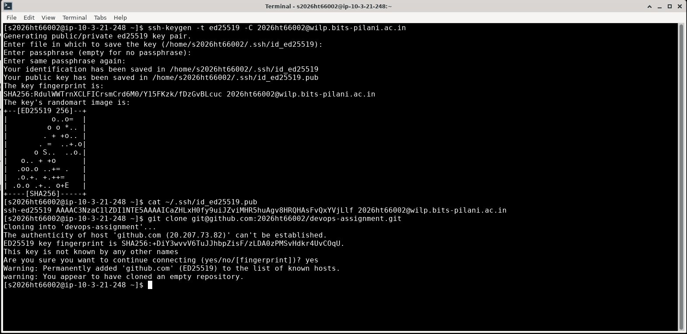

**Step 2: Inspect the project files and commit the initial Flask application and requirements.**

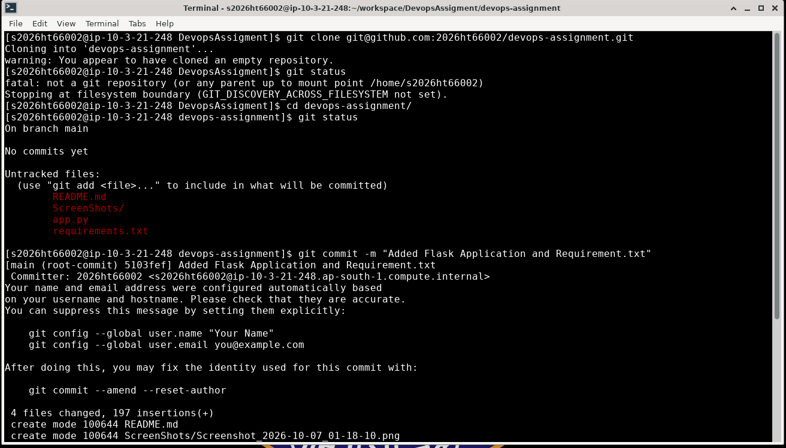

**Step 3: Rename the branch to `main` and push it to GitHub.**

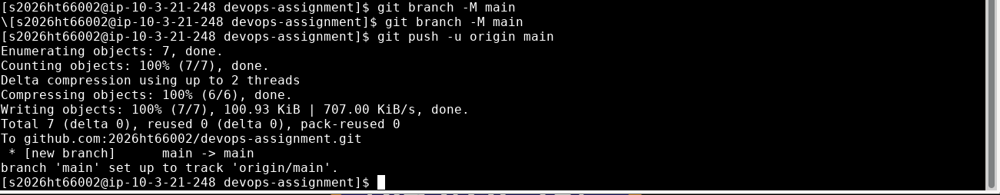

**Step 4: Create `feature/unit-test`, add the tests directory, and commit the application tests.**

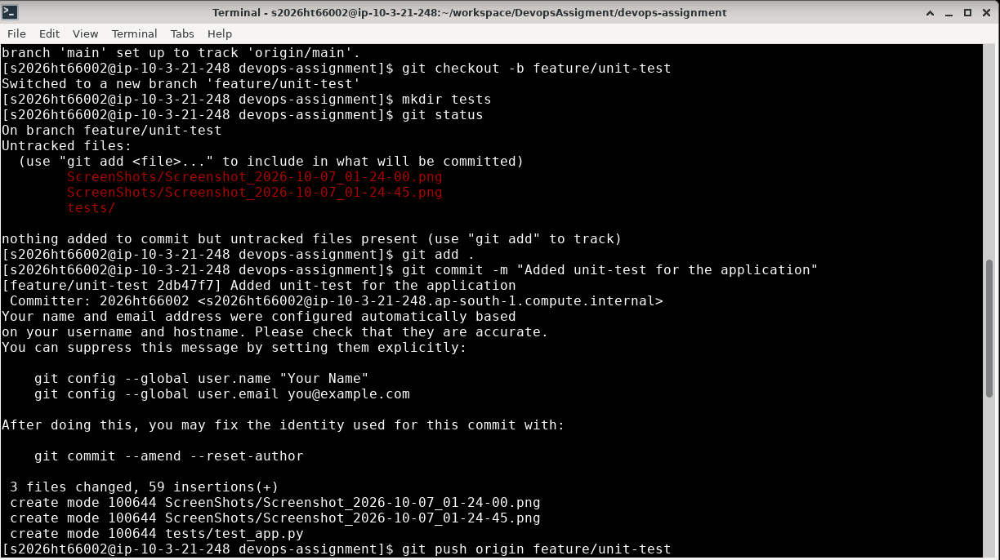

**Step 5: Push `feature/unit-test`, merge it into `main`, and push the updated main branch.**

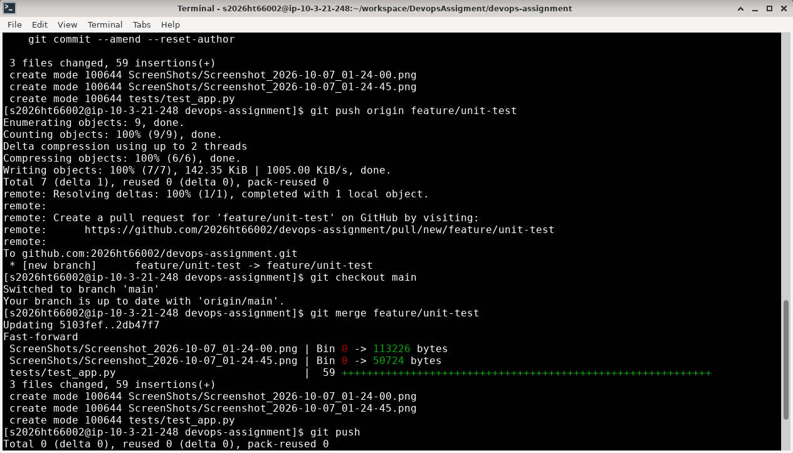

### CI/CD Branch and Local Verification

**Step 6: Create `feature/ci-cd` and check that the Dockerfile and Jenkinsfile are ready to add.**

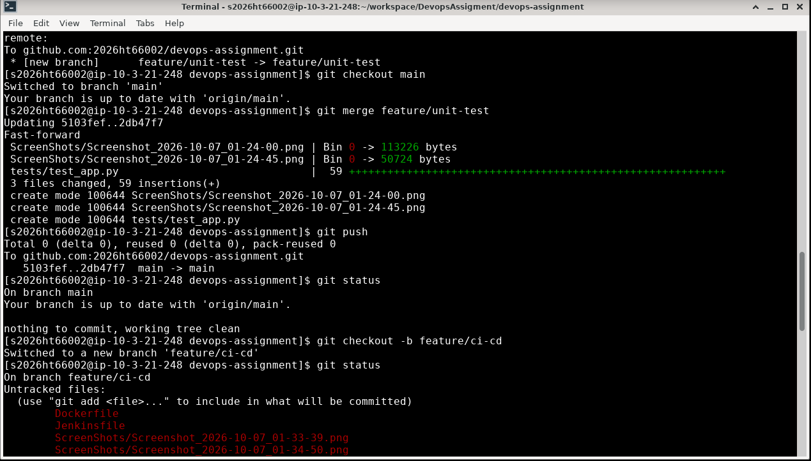

**Step 7: Commit the Dockerfile and Jenkinsfile on `feature/ci-cd`, then push the branch to GitHub.**

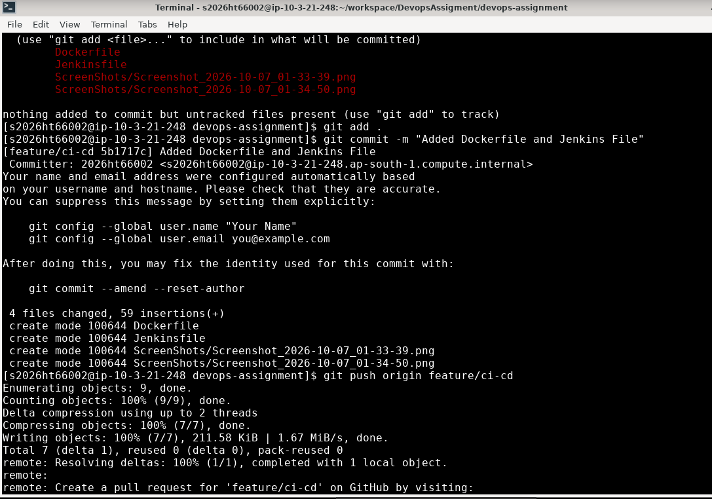

**Step 8: Switch to `main` and merge `feature/ci-cd`, adding the Dockerfile and Jenkinsfile to the main branch.**

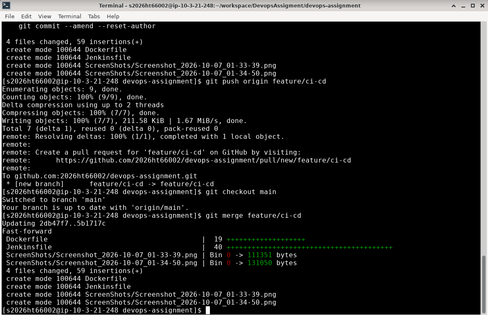

**Step 9: Build the image as `gym-app` and start it in the background, mapping host port `5000` to container port `5000`.**

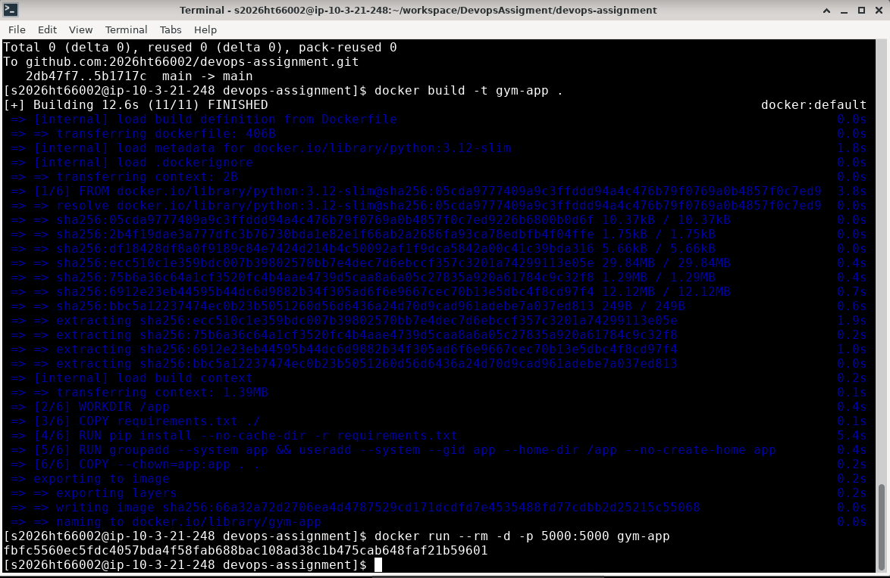

**Step 10: Request `/plans` from the running container and confirm the response includes the Basic, Premium, and Elite plans.**

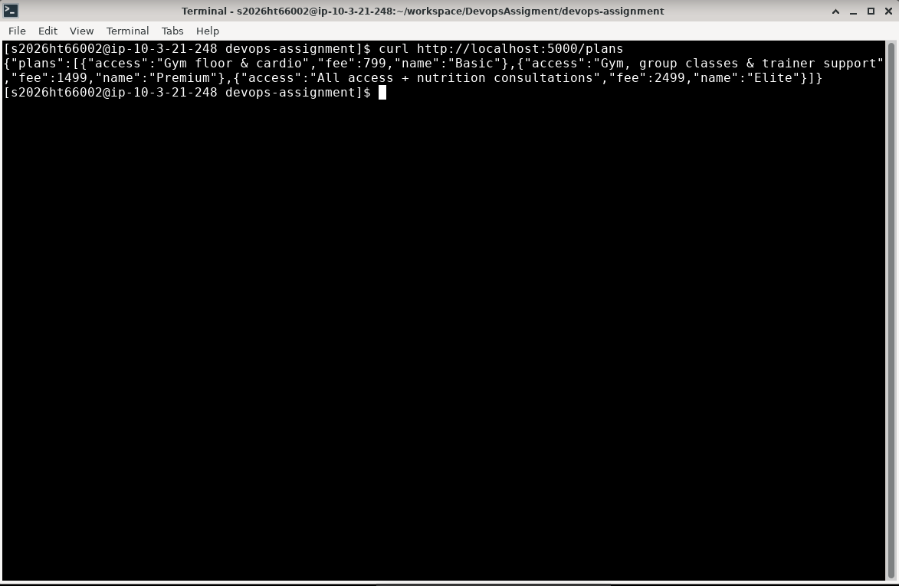

### Jenkins

**Step 11: Create a Jenkins item named `aceest-gym-cicd` and select the Pipeline type.**

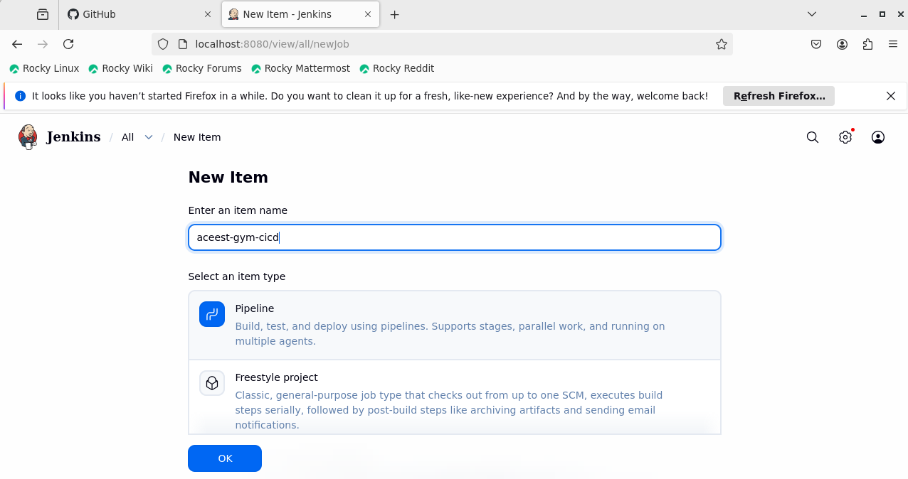

**Step 12: In Jenkins, add a credential containing your GitHub username and password for repository access.** Do not copy or expose credentials from screenshots.

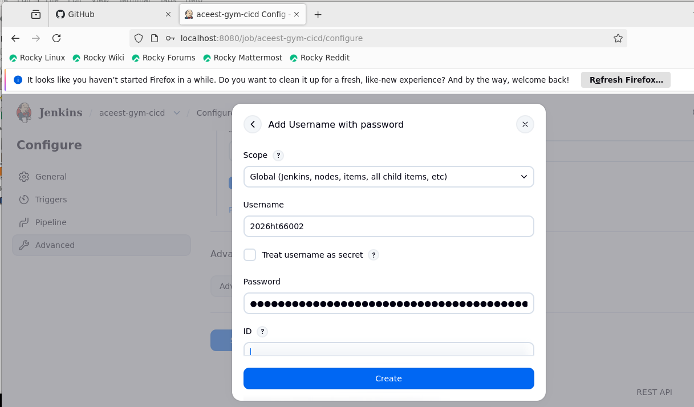

**Step 13: Configure the repository URL, select the credential, and specify the `main` branch.**

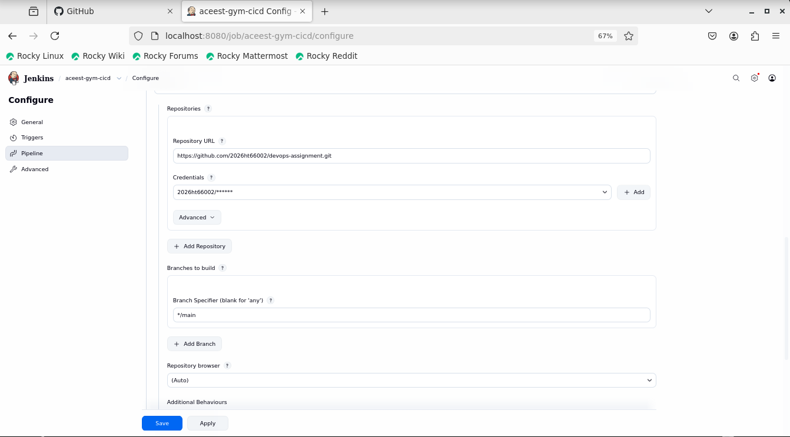

**Step 14: Run the Jenkins pipeline and confirm checkout, dependency installation, tests, and Docker image build succeed.**

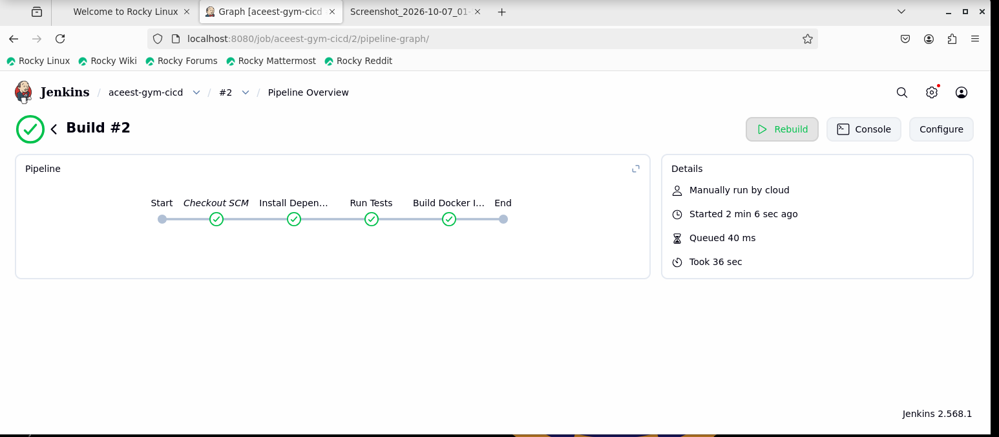

### GitHub Actions

**Step 15: Add and commit the GitHub Actions workflow on the CI/CD branch.**

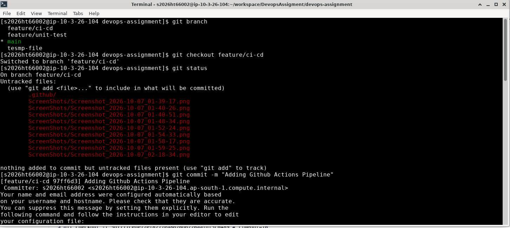

**Step 16: Confirm that the GitHub Actions job succeeds through the Docker image build.**

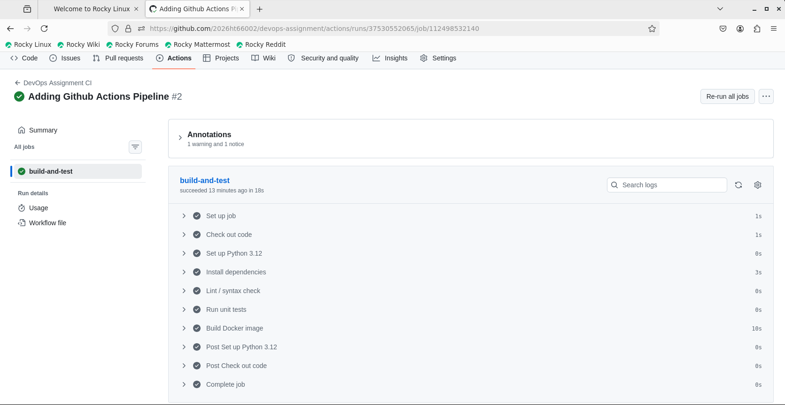

**Step 17: Confirm that the workflow runs the Docker image and requests `/plans`, receiving the plans JSON.**

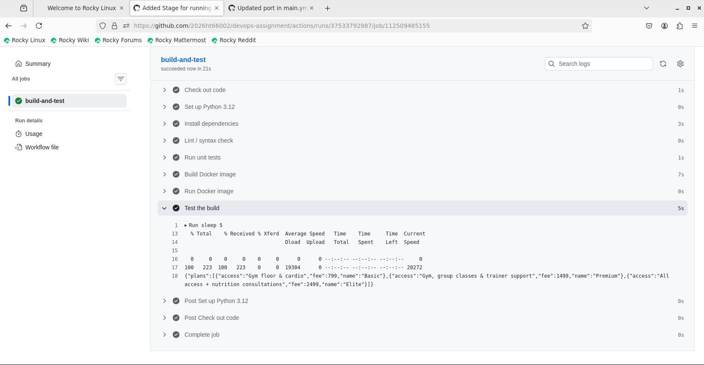

## Project Files

- `app.py` contains the Flask routes and sample data.
- `tests/test_app.py` contains the automated endpoint tests.
- `Dockerfile` defines the container image.
- `.github/workflows/main.yml` defines GitHub Actions validation.
- `Jenkinsfile` defines the Jenkins build pipeline.
- `ScreenShots/` contains the project walkthrough images.

## License

This project is for academic learning and assignment submission purposes.
